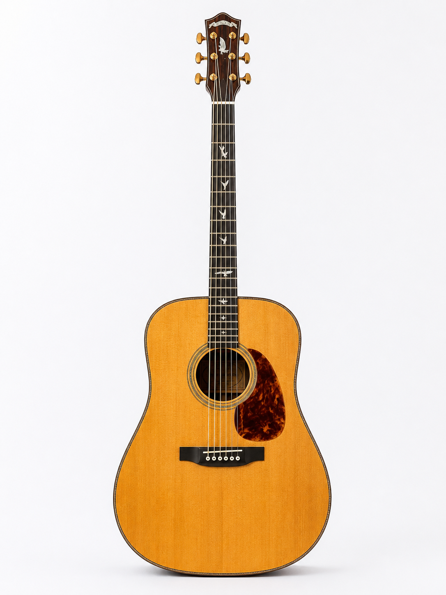
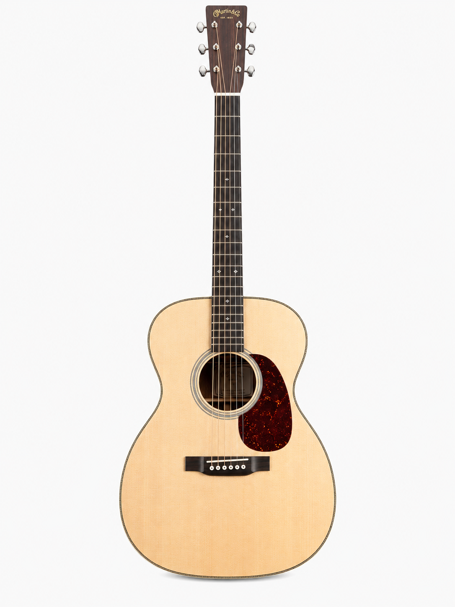
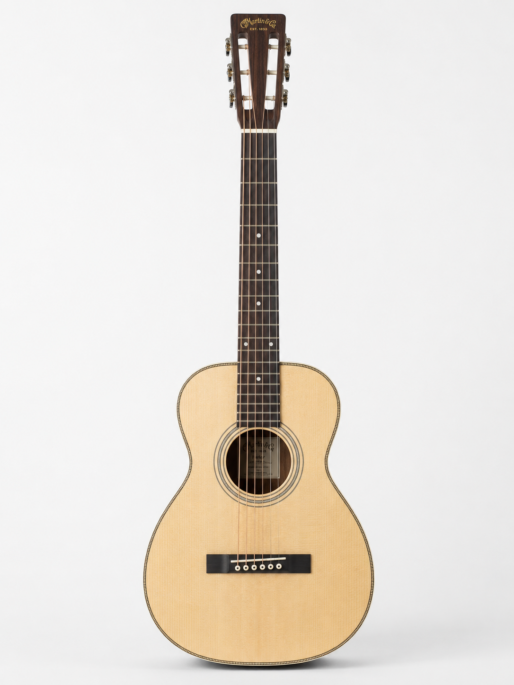
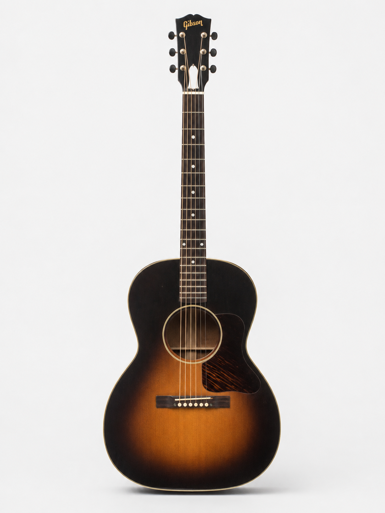
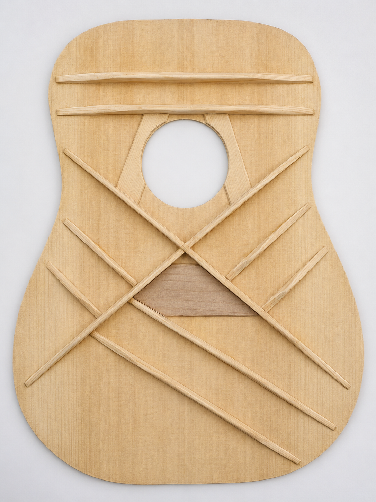
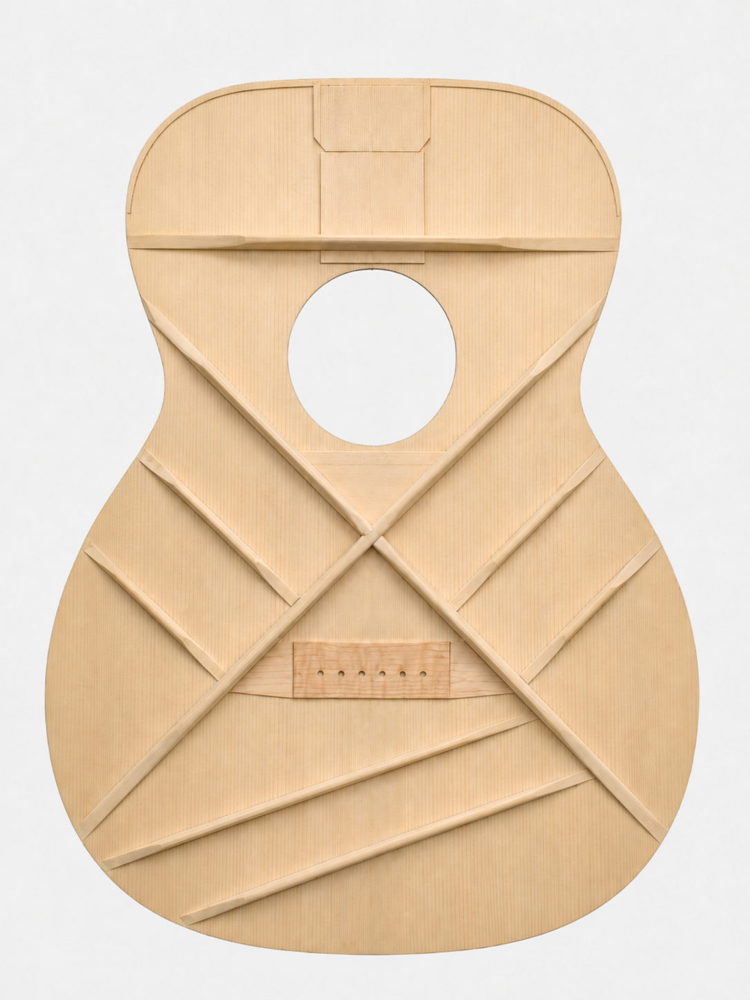
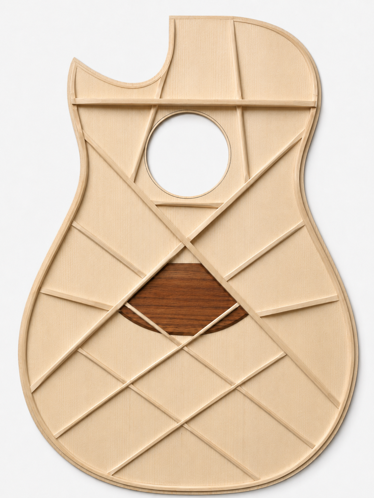

# Vex Rendering: Learning the Acoustic Behavior of Guitars from Partial Sensor Observations

## Abstract

Acoustic guitars are complex mechanical-acoustic systems whose perceived sound is shaped not only by string vibration, but also by body geometry, soundboard response, bracing structure, tonewoods, air-cavity resonance, pickup placement, and the downstream pickup–preamp signal chain. Contemporary acoustic guitar amplification systems rely on magnetic soundhole pickups, piezo pickups, analog preamps, digital filters, impulse-response processing, and acoustic imaging techniques to approximate microphone-like tone. However, these systems remain constrained by pickup-specific coloration, preamp pairing, limited controllability, and incomplete observation of the full radiated acoustic field.

This paper introduces **Vex Rendering** as an ongoing research project for learning the acoustic behavior of acoustic guitars from partial sensor observations. The central hypothesis is that pickup and contact-sensor signals should be treated as incomplete measurements of a hidden acoustic state, while microphone recordings serve as target observations of the instrument’s radiated sound. As a first-stage baseline, we study a HiFi-GAN-based direct neural rendering approach that maps pickup-derived signals to microphone-like acoustic audio. This baseline provides a practical proof of concept for data-driven acoustic rendering, but also exposes limitations of non-latent black-box generation, including weak physical interpretability, limited controllability, pickup-specific overfitting, and difficulty representing body resonance and spatial acoustic behavior.

Motivated by these limitations, we propose a DDSP-inspired latent-variable direction for structured acoustic modeling. Instead of directly translating pickup signals into waveforms, the proposed framework infers intermediate acoustic variables such as pitch, harmonic energy, transient excitation, decay envelopes, resonance behavior, and noise components, then renders audio through differentiable synthesis modules. This formulation aims to provide stronger physical inductive bias, better interpretability, and a more flexible path toward controllable acoustic sound generation. More broadly, Vex Rendering serves as a research probe into whether modern neural architectures can learn, represent, and eventually manipulate the acoustic behavior of instruments from partial observations.

# 1. Introduction

The acoustic guitar occupies an important position in both musical culture and the musical-instrument industry. As a portable, expressive, and harmonically rich instrument, it is widely used across folk, pop, rock, country, jazz, fingerstyle, and contemporary instrumental music. The guitar market remains a significant part of the global instrument economy; recent market reports estimate the global guitar market in the range of several billions to more than ten billion U.S. dollars, with acoustic guitars representing a major product segment (see, for example, Grand View Research, *Guitar Market Size Report, 2023*, available at https://www.grandviewresearch.com/industry-analysis/guitar-market). Beyond its commercial importance, the acoustic guitar is also a compelling physical system: a small mechanical excitation at the string is transformed by the bridge, soundboard, bracing, back, sides, internal air cavity, and surrounding environment into a complex radiated acoustic field.

This complexity makes acoustic guitar amplification and modeling a difficult problem. Unlike an electric guitar, where the pickup signal is often treated as the primary musical signal, the perceived sound of an acoustic guitar is strongly shaped by the instrument body itself. The strings, saddle, bridge, soundboard, bracing pattern, tonewoods, body geometry, and air resonance jointly determine how mechanical energy is distributed and radiated. A dreadnought guitar, an OM guitar, a small-body parlor guitar, and a modern lattice-braced instrument may respond very differently to the same playing gesture. Therefore, the microphone sound of an acoustic guitar is not merely the sound of vibrating strings; it is the result of a coupled mechanical-acoustic rendering process.

Contemporary acoustic guitar pickup systems add another layer of complexity. A magnetic soundhole pickup, an undersaddle piezo pickup, a bridge-plate transducer, and an internal microphone each observe different partial projections of the instrument. A soundhole magnetic pickup can produce a strong, musical, and feedback-resistant signal, especially when paired with a suitable preamp, but it primarily senses string motion and may not preserve the full acoustic body response. A piezo pickup is more directly coupled to bridge or saddle vibration and can capture attack and mechanical detail, but it is still a local sensor and often lacks the spatial radiation, air coupling, and body image captured by an external microphone. In practical performance systems, the final tone is further shaped by pickup placement, impedance matching, preamp design, gain staging, EQ, compression, phase alignment, reverb, and blending. Thus, acoustic guitar amplification is already a hand-designed rendering chain rather than a transparent reproduction of the instrument.

Existing commercial solutions approach this problem using a mixture of analog circuitry, digital filtering, impulse response processing, microphone modeling, and acoustic imaging. Traditional analog systems include tube-based and transistor-based preamps, each introducing its own tonal coloration and impedance behavior. Digital systems such as Fishman Aura, LR Baggs Voiceprint DI, Audio Sprockets ToneDexter, BOSS AD-10, and Yamaha AG-Stomp attempt to recover a more microphone-like acoustic tone through impulse responses, learned pickup-to-microphone transforms, acoustic resonance controls, or microphone modeling (Fishman Aura; LR Baggs Voiceprint DI; ToneDexter; BOSS AD-10; Yamaha AG-Stomp). These systems demonstrate that the industry has long recognized the gap between pickup sound and microphone sound. However, they remain limited by pickup-preamp pairing, fixed processing structures, handcrafted controls, limited model capacity, and difficulty representing the full nonlinear, time-varying behavior of the instrument.

Recent progress in deep generative audio models suggests a different research direction. Models such as WaveNet and HiFi-GAN have shown that neural networks can generate high-fidelity waveforms and learn complex audio distributions directly from data (WaveNet; HiFi-GAN). Although these methods were originally developed mainly for speech synthesis and neural vocoding, they motivate a broader question: can similar data-driven methods be used to learn the acoustic behavior of musical instruments from partial sensor observations? Instead of manually designing an acoustic rendering chain through pickup selection, preamp coloration, EQ, and DSP filters, we may train neural models to infer the missing acoustic structure between a local pickup signal and a microphone-like radiated sound.

This paper introduces **Vex Rendering** as an ongoing research project toward neural acoustic modeling of acoustic guitars. The goal is not only to make a pickup signal sound more pleasing, but to study whether modern neural architectures can learn the relationship between partial sensor observations and the fuller acoustic behavior of the instrument. In this sense, Vex Rendering treats pickup signals as incomplete measurements of a hidden acoustic state, and microphone recordings as target observations of the radiated acoustic field.

As a first step, this work studies a direct neural rendering baseline based on HiFi-GAN. The baseline tests whether a high-capacity adversarial waveform generator can map pickup-derived features to microphone-like acoustic guitar audio. This approach is useful because it provides an initial proof of concept and exposes the strengths and weaknesses of purely data-driven, non-latent-variable rendering. However, direct neural rendering does not explicitly model the physical or perceptual factors that produce acoustic guitar tone. It may learn a plausible mapping from input to output, but it does not necessarily reveal how string excitation, body resonance, transient noise, decay behavior, or spatial radiation are represented.

Motivated by these limitations, the paper then proposes a DDSP-inspired latent-variable research direction. Instead of learning only a black-box mapping from pickup signal to waveform, the latent-variable formulation introduces an intermediate acoustic state that can represent pitch, harmonic energy, transient components, resonance envelopes, body response, and noise-like excitation. A structured differentiable renderer can then synthesize the target waveform from these inferred latent variables. This approach is intended to provide stronger physical inductive bias, better interpretability, and more controllable acoustic rendering.

The purpose of this paper is therefore exploratory. It documents the first stage of Vex Rendering as a research probe into neural acoustic guitar modeling: beginning with a HiFi-GAN baseline, analyzing the limitations of direct non-latent rendering, and outlining a DDSP-style latent-variable path toward more interpretable acoustic modeling. More broadly, this work asks whether the complex acoustic behavior of an instrument can be learned from data, represented through structured latent variables, and eventually manipulated to produce realistic, personalized, or even novel acoustic timbres.

# Acoustic Guitar System Background
## 2.1 Acoustic Guitar Body Shapes

Acoustic guitars appear in many body shapes, and new shapes continue to be invented by modern luthiers and manufacturers. Body-shape terminology is not fully standardized across the guitar industry; even familiar names such as dreadnought, OM, 000, L-00, jumbo, and parlor often describe families of related designs rather than exact geometric specifications. For this reason, this paper focuses on several representative classic shapes rather than attempting to cover every possible design. These classic shapes are useful because they occupy different regions of the acoustic design space and are commonly associated with different tonal families, playing styles, ergonomic choices, and sensor-response behaviors.

From an acoustic-modeling perspective, body shape matters because it changes the transfer path from string excitation to radiated sound. When a string is plucked, energy travels through the saddle and bridge into the soundboard, bracing system, back, sides, internal air cavity, and soundhole. The resulting microphone signal is not produced by the strings alone; it is produced by the coupled behavior of the full soundbox. In Ervin Somogyi’s formulation, the guitar can be understood at a practical level as an “air pump,” where the vibrating top and back are the major acoustically active surfaces, separated by comparatively non-vibrating sides. The efficiency and character of this air-pumping system depend on body geometry, material selection, bracing, plate thickness, and construction stiffness.

Therefore, body shape should not be reduced only to air volume or soundhole pressure. Air-cavity resonance is important, but it is only one part of the soundbox system. Body shape also changes the active area of the lower bout, the waist geometry, the relative size and stiffness of the top and back, the bridge location within the vibrating field, the coupling between top and back, the directionality of projection, and the ergonomic relationship between player and instrument. Somogyi’s discussion of the modified dreadnought is especially relevant here: his design was not only an acoustic choice, but also an ergonomic and geometric re-contouring of the dreadnought body, using a more Spanish-guitar-like waist placed near the instrument’s center of balance while retaining dreadnought size and power.

A useful physical intuition is that larger bodies generally provide greater internal air volume, larger vibrating plate area, lower main air resonance, and stronger low-frequency support. Smaller bodies often produce a faster, more immediate, and more focused response, not because they contain more total acoustic energy, but because their smaller air cavity and reduced plate area tend to shift the response toward quicker attack, stronger midrange focus, and less low-frequency bloom. Body shape also affects how the six strings combine. Some guitars emphasize separation and articulation; others blend the six strings into a wider, more unified acoustic image.

### Dreadnought / Greven Oshio-D

The dreadnought is one of the most influential steel-string acoustic guitar shapes. It has a relatively large body, wide lower bout, and deep air cavity compared with smaller body styles. Its larger soundbox generally supports strong bass response, projection, and broad dynamic range. This makes the dreadnought especially suitable for strumming, ensemble playing, and styles where the six strings blend into a full, unified chordal voice.

### OM / Martin OM-28

The OM, or Orchestra Model, represents a mid-sized acoustic guitar body. It is smaller than a dreadnought but larger than many parlor or 00-style guitars. The OM family is often associated with balanced tone, comfort, projection, and fingerstyle responsiveness. It typically offers a clear and even frequency response, with good note separation and articulation, making it well suited for fingerstyle playing and detailed musical expression.

### Small-body / Martin Parlor

Parlor guitars and other small-body instruments occupy the compact end of the acoustic guitar family. Their smaller bodies usually have less internal air volume and reduced low-frequency extension, but they often produce a quick, focused, and intimate response. These guitars emphasize midrange clarity and fast attack, making them suitable for fingerstyle, blues, and vocal accompaniment.

### Small-body blues guitar / Gibson L-00

The Gibson L-00 is a classic small-body acoustic shape, historically associated with blues and folk styles. Compared with larger guitars, it has a more focused tonal center and produces a dry, woody, and punchy sound. Its strong attack and midrange presence make it effective for expressive, rhythmically driven playing.

| Guitar | Representative shape family | Acoustic role in this project |
|---|---|---|
|  **Greven Oshio-D** | Dreadnought / modified dreadnought | Large-body reference with strong projection, bass response, broad dynamic range, and blended six-string chordal behavior. Useful for studying powerful body radiation, lower-bout activity, and complex string-to-body coupling. |
|  **Martin OM-28** | OM / Orchestra Model | Mid-sized reference with balanced bass, midrange, and treble. Useful for studying note separation, fingerstyle articulation, and string-level detail. |
|  **Martin Parlor** | Parlor / small body | Compact-body reference with quick response, focused midrange, intimate projection, and clear transient behavior. Useful for studying fast attack and reduced low-frequency bloom. |
|  **Gibson L-00** | Small-body blues guitar | Compact vintage-style reference with focused, woody, punchy response. Useful for studying small-body midrange character and dry acoustic articulation. |

## 2.2 Guitar Structure and Acoustic Components

An acoustic guitar is not a single resonator, but a coupled mechanical-acoustic system. The final sound is produced by the interaction of many components: strings, saddle, bridge, soundboard, bracing, back, sides, soundhole, internal air cavity, neck, and the player’s excitation technique. Each component has an individual function, but none of them acts independently. The guitar’s tone emerges from the way these parts exchange energy over time.

This is one reason acoustic guitar modeling is difficult. A pickup signal may observe one local part of the system, such as string motion, saddle pressure, bridge vibration, or top-plate motion, while a microphone captures the result of the full coupled soundbox. Therefore, it is useful to briefly review the main components and their roles before discussing modeling approaches.

### Strings

Strings provide the initial excitation. They determine pitch, harmonic content, and dynamic envelope, but most of the audible sound depends on how their energy is transferred into the body.

### Saddle

The saddle acts as the interface between strings and bridge, converting string motion into force applied to the body. It is also a common location for piezo pickups, making it important for sensor-based modeling.

### Bridge

The bridge transfers string energy into the soundboard. Its mass and geometry influence how efficiently the top is driven and how energy spreads across the instrument.

### Soundboard / Top Plate

The soundboard is the primary vibrating surface that converts mechanical energy into sound. It must balance structural strength with flexibility to remain responsive.

### Bracing System

The bracing system is the internal structure beneath the soundboard. While it provides necessary reinforcement against string tension, it also plays a central role in shaping the guitar’s acoustic response.

Bracing controls how stiffness is distributed across the top, influencing vibration patterns, resonance modes, and tonal balance. It affects key perceptual qualities such as bass response, clarity, sustain, projection, and dynamic range. Small changes in brace shape, placement, or mass can significantly alter the instrument’s voice.

For example, scalloped bracing removes material from braces to increase flexibility, often resulting in greater responsiveness and stronger bass. More rigid bracing can produce a tighter, more controlled sound. Because bracing governs how energy travels through the soundboard, it is one of the most important factors in guitar voicing.

In the context of acoustic modeling, bracing highlights why external shape alone is insufficient to describe a guitar’s sound. Internal structural differences can lead to large acoustic variations even between visually similar instruments.

### Back and Sides

The back and sides form the body enclosure. The sides define the shape and volume of the cavity, while the back can either reflect or actively participate in vibration, contributing to the overall resonance.

### Soundhole and Air Cavity

The soundhole and internal air cavity form a resonant system that contributes to low-frequency response and projection. They interact with the vibrating plates rather than acting as an isolated sound source.

### Tonewoods and Material Response

Different woods influence stiffness, density, and damping, which affect how the instrument vibrates. However, material alone does not determine tone; its effect depends on how it is used within the overall structure.

### Neck and Player Coupling

The neck contributes mass and stiffness and affects string tension through scale length. The player’s interaction with the instrument also influences excitation, making performance technique part of the acoustic system.

### Coupled Vibration Behavior

The most important point is that these components do not act independently. The string excites the saddle, which drives the bridge; the bridge drives the soundboard; the soundboard interacts with the bracing; the top and back couple through the air cavity; and the entire structure radiates sound.

Because of this coupling, a change in one component can affect the entire system. This is why acoustic guitar sound is difficult to capture with pickups and challenging to model computationally. A pickup observes only a partial signal, while a microphone captures the integrated acoustic result. Vex Rendering aims to learn this relationship between local measurements and global sound.

### Bracing Design Diversity

The following bracing examples illustrate how different internal architectures can shape the response of similar steel-string acoustic guitars.

| Bracing design | Diagram | Structural idea | Expected acoustic tendency | Relevance to Vex Rendering |
|---|---|---|---|---|
| **Pre-war D-28 / dreadnought-style X-bracing** |  | Large X-brace structure under the soundboard, often associated with dreadnought-style guitars. In pre-war-inspired designs, the X-brace is commonly discussed together with scalloping and forward-shifted placement. | Strong projection, bass support, broad dynamic range, and smooth six-string blending. The large lower bout and X-brace structure help create the powerful dreadnought voice. | Useful as the large-body baseline for studying blended chordal response, strong low-frequency radiation, and complex string-to-body coupling. |
| **OM-28-style X-bracing** |  | X-bracing adapted to a smaller OM body, with the structural layout scaled to a mid-sized soundbox. | Balanced bass, midrange, and treble; strong note separation; quicker response than a large dreadnought; good dynamic sensitivity for fingerstyle. | Useful for studying string-level articulation, note separation, and the model’s ability to preserve balanced mid-sized guitar identity. |
| **Contemporary mesh-like / Somogyi-derived bracing** |  | A distributed brace network that divides the lower bout and soundboard into many smaller interacting regions rather than relying only on a few dominant braces. | Potentially greater control over local stiffness, modal distribution, response speed, and separation between structural support and acoustic freedom. | Useful for future work on white-box acoustic modeling, because distributed bracing suggests a more spatially structured latent representation of top-plate vibration. |

These designs show why the acoustic guitar should be treated as a complex physical system rather than a simple resonant box. The bracing pattern determines how energy flows through the soundboard and how the instrument balances responsiveness and structural stability. In a machine learning context, this implies that a model must capture not only observable signals but also the hidden structural factors that shape acoustic behavior.

## References
- Ervin Somogyi, *The Responsive Guitar*. Luthiers Press, 2010.
- C. F. Martin & Co., “Guide to Acoustic Guitar Body Sizes & Shapes.”
- UNSW Physics, “Helmholtz Resonance.”
- Michael Watts, “Guitar Resonance and the Geometry of Soundholes.”
- Gibson, “L-00 Acoustic Guitars.”
- Acoustic Guitar Magazine, “How the Orchestra Model Went from a Flop to Become One of the Most Popular Guitar Types.”

## Project Status

This repository documents an ongoing research project. The current stage focuses on:
- establishing a HiFi-GAN-based direct neural rendering baseline;
- analyzing the limitations of non-latent pickup-to-microphone rendering;
- developing a DDSP-inspired latent-variable framework for interpretable acoustic modeling.

## Paper Draft

The working paper is organized as:
1. Introduction
2. Acoustic Guitar System Background
3. Problem Formulation
4. Related Work
5. Vex Rendering System Overview
6. HiFi-GAN Baseline
7. Limitations of Direct Neural Rendering
8. DDSP-Based Latent Acoustic Modeling
9. Workflow Comparison
10. Experimental Design
11. Discussion
12. Limitations and Future Work
13. Conclusion